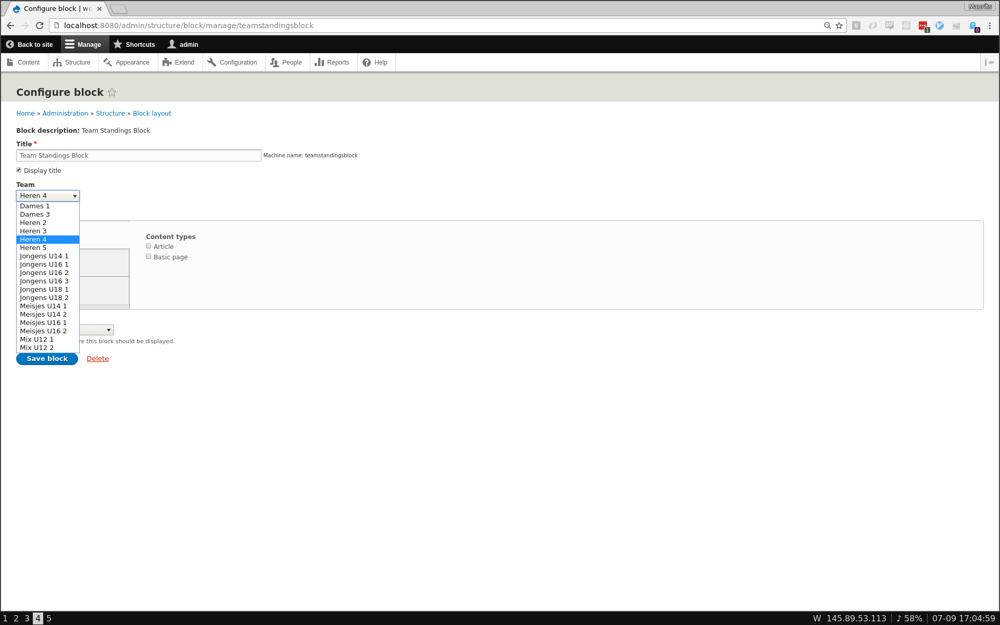
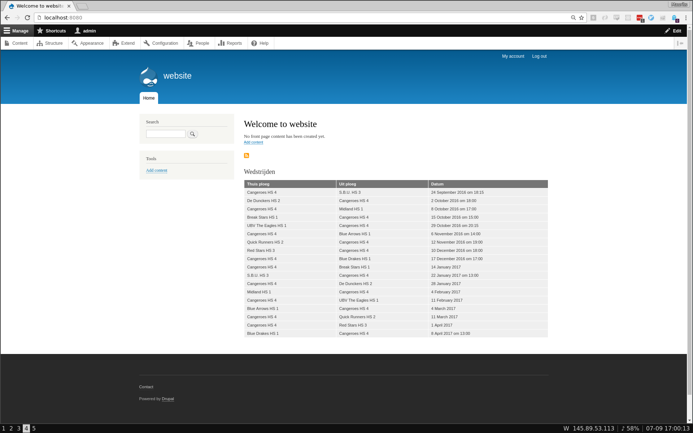

# Drupal 8 NBB Module

> Show team information from the Dutch Basketball Association (Nederlandse Basketbalbond, NBB)

## Screenshots




## Install

Copy this folder to your Drupal 8.x `modules/` folder.
Set your club ID in `modules/nbb/config/install/nbb.settings.yml`.
Install the module (via Extend) and add `Team Standings` blocks under Block Layout.
More info about the API this module uses can be found here: [http://db.basketball.nl/help/koppelingen](http://db.basketball.nl/help/koppelingen).

## Test

```bash
cp .env.example .env
docker-compose up -d
# > Navigate to localhost:8080
# > For database configuration use .env
# > Change host from 'localhost' to 'mysql' under Advanced Settings

# docker exec -it drupalnbbmodule_drupal_1 sh -c 'php -r "readfile(\"https://s3.amazonaws.com/files.drush.org/drush.phar\");" > /usr/local/bin/drush && chmod +x /usr/local/bin/drush'
```

## License

This software is licensed under the [MIT license](https://github.com/Cangeroes/drupal-nbb-module/blob/master/LICENSE).

© 2016 Cangeroes
